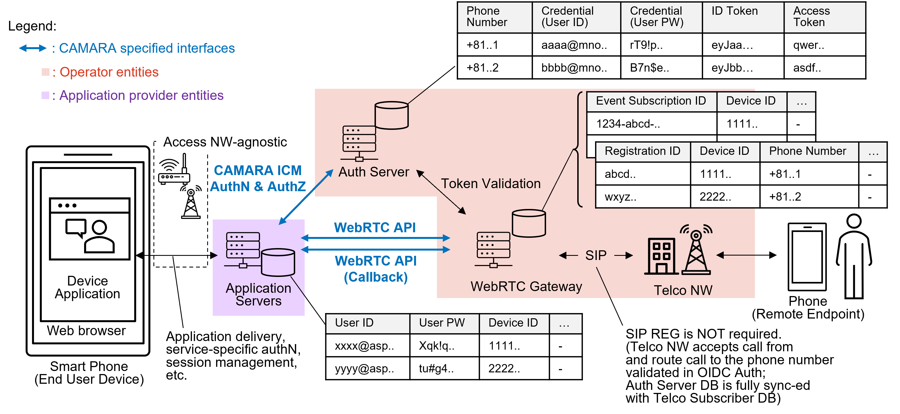

# WebRTC API User Story (Inbound-Outbound calling: ASP-WebRTC Gateway scenario)

| **Item** | **Details** |
| --- | --- |
| ***Summary*** | As a web application developer, I want to develop and provide a WebRTC application through an Application Service Provider that enables end users to make and receive calls (outbound and inbound) over the internet using carrier phone numbers.|
| ***Actors and Scope*** | **Actors:** Device Application, Application Servers (API Consumer), Auth Server, WebRTC Gateway (API Provider), Telco Network, Remote Endpoint.   **Scope:**  <ul><li>Outbound calls: Initiate calls to Remote Endpoints in the Telco Network using phone numbers and establish media sessions. </li><li>Inbound calls: Receive calls from Remote Endpoints in the Telco Network using phone numbers and establish media sessions.</li></ul>|
| ***Pre-conditions*** | The preconditions are listed below: <ul><li>**Device Application:** <ul><li>Provided to end users from the Application Service Provider's Application Servers.</li><li>Users are authenticated by the Application Servers provided by the Application Service Provider, and the Device Application and Application Servers are connected via a secure communication channel.</li></ul></li><li>**Application Servers:** <ul><li>Operated by the Application Service Provider and functions as a WebRTC API Consumer. Makes requests to the WebRTC Gateway in response to Device Application requests. Notifications from the WebRTC Gateway to the Application Servers are relayed to specific Device Applications based on their content.</li><li>Authenticates Device Application users with proprietary service IDs and credentials. The connection between Application Servers and Device Applications is protected by a secure communication channel. As a result of end user consent through authentication and authorization using the communication carrier account, tokens for requesting the WebRTC API in response to Device Application requests are issued by the communication carrier.</li></ul></li><li>**Auth Server:** <ul><li>An authentication and authorization server operated by the communication carrier that manages the association between end users utilizing the Device Application and the phone numbers available to those users.</li><li>Performs end user authentication, authorization, and consent using communication carrier accounts, and tokens are issued to Application Servers for accessing the WebRTC API.</li></ul></li><li>**WebRTC Gateway:** <ul><li>A server operated by the carrier that functions as the WebRTC API provider which validates API requests from Application Servers using the Auth Server and provides registration enabling calls using end user phone numbers, call event notifications, and interworking functionality to the Telco Network.</li></ul></li><li>**Telco Network:** <ul><li>The communication carrier's telephony service network, connected to the WebRTC Gateway.</li></ul></li><li>**Remote Endpoint:** <ul><li>An endpoint capable of using the communication carrier's telephony service, connected to and registered with the Telco Network.</li></ul></li></ul>   See below figure. |
| ***Activities/Steps*** | **Starts when:** In response to a Device Application request, the Application Server prepares to establish a media session with the WebRTC Gateway.   **Step 1:** The Application Server configures event notification subscriptions with the WebRTC Gateway for call state changes and incoming calls for each Device Application.   **Step 2:** The Application Server performs registration with the WebRTC Gateway to enable outbound-call and inbound-call for each Device Application. At this time, the phone number to be used is presented to the Application Server by the WebRTC Gateway.   **Step 3a:** (When the Device Application initiates an outbound-call) In response to a Device Application request, the Application Server sends a media session establishment request to the WebRTC Gateway, specifying the originating and terminating phone numbers. The WebRTC Gateway validates the requested phone numbers and interworks the session establishment request to the Telco Network, while responses from the Telco Network are sent to the Application Server as interworking result event notifications. Once the necessary negotiation is completed, a media session is established between the Device Application and the Remote Endpoint.   **Step 3b:** (When the Device Application receives an inbound-call) When an incoming call arrives from the Telco Network, the WebRTC Gateway sends an incoming call event notification to the Application Server. The Application Server retrieves detailed call information from the WebRTC Gateway and performs the necessary negotiation to establish the media session. Once the necessary negotiation is completed, a media session is established between the Device Application and the Remote Endpoint.   **Ends when:** A call media session is established between the Device Application and the Remote Endpoint.|
| ***Post-conditions*** | When media session state changes (e.g., media modifications) or registration expiration occurs, the WebRTC Gateway sends event notifications to the Application Server, and actions such as renegotiation or registration refresh are performed. The media session terminates when disconnected by either the Device Application or the Remote Endpoint.|
| ***Exceptions*** | Several exceptions might occur during the WebRTC API operations: - Unauthorized: Invalid credentials (e.g., expired access token). - Incorrect input data (e.g., malformed phone number). - Not able to provide: Appropriate event subscriptions and registration have not been performed by the Application Server to initiate outbound-calls or enable inbound-calls reception.|
---
