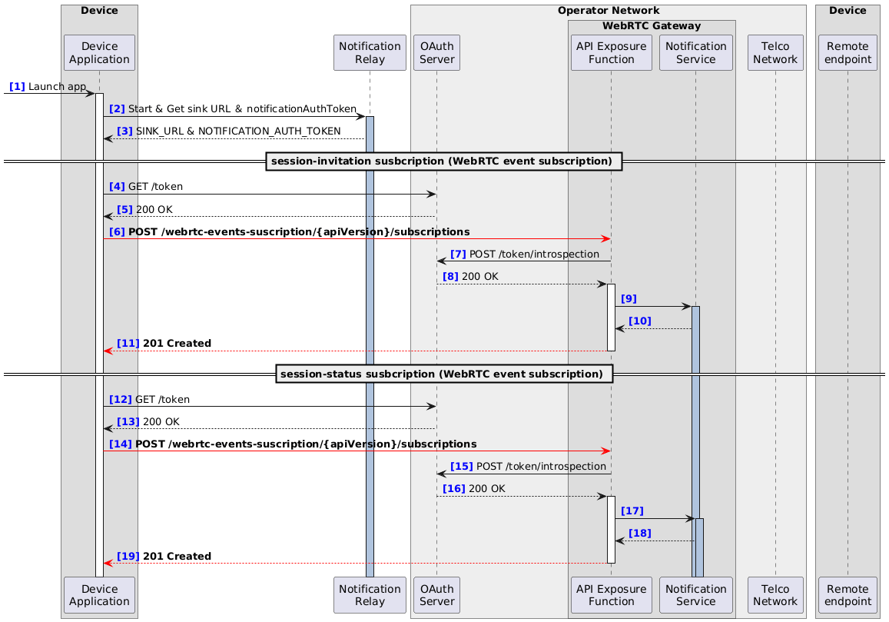

# WebRTC API Call Flow

## 1. Purpose

This document provides example call flows for implementers of a WebRTC gateway that exposes WebRTC APIs and interworks with the telco network.

## 2. Assumptions

There are two cases for a WebRTC API Invoker:

- The API Invoker is an application on the end-user device

- The API Invoker is a server of a third-party application service provider

Depending on the above cases, the entities involved in the call flow, the deployment of endpoints receiving event notifications, and the sequence of the call flow will differ.  

This call flow illustrates the former case.

## 3. Entities

The main entities involved in the call flow are as follows:

- **Device Application**：Acts as the WebRTC API Invoker. When the API Invoker is the end user, this is a native application or web application running on the user’s device.

- **API Exposure Function**：Acts as the WebRTC API Provider, and also performs SIP message interworking with the telco network. 

- **Notification Service**：Works with the API Exposure Function to deliver event notifications to the Device Application. 

- **Telco Network**：SIP Proxy/Registrar belonging to the operator's telco network.

- **Remote Endpoint**：The peer in the call using the WebRTC API, which is a SIP application running on a remote device.

The **WebRTC Gateway** consists of the API Exposure Function and the Notification Service.

Since the API Invoker is an end user and the Device Application is not itself an HTTP endpoint for receiving event notifications directly, the following entity is included:

- **Notification Relay**：Receives event notifications from the Notification Service and relays them to the Device Application. In its WebRTC event subscription, the Device Application configures this entity’s HTTP endpoint as the sink. To do so, the Device Application first obtains information about this entity and establishes a connection to receive the relayed notifications. The Notification Relay is considered to be associated with the Device Application, and may be provided either by the Telco Operator or by a third-party application provider. In this flow, the example is given in a way that does not depend on either case.

This call flow also illustrates the authorization procedure involved in using the WebRTC API. Therefore, the following entity is included:

- **OAuth Server**：Performs authentication and authorization of API usage in accordance with the CAMARA ICM specification. Since authorization in the WebRTC API is based on subscriber information, the OAuth Server is assumed to be deployed in the Telco network.


## 4. Call flow diagrams and message examples

The following sections show the call flow and major message examples. Message exchanges defined by the WebRTC API are indicated with red arrows. The call flow also explicitly illustrates the sequence for obtaining access tokens associated with WebRTC API requests and for validating those tokens.

### 4.1. Subscription for call-related events

This part of the call flow involves subscribing to call-related events.

> [!NOTE]
> In line with the Gap Issue(#64), if these subscription takes place prior to the registration, these subscriptions do not require a registrationId to be set.

> [!NOTE]
> If the session-status subscription is decoupled from a specific media session, session-status subscription does not require a sessionId to be set.

> [!NOTE]
> Once the above changes are reflected, it becomes possible to subscribe to these event types at the same time. According to the update of the CAMARA API Design Guide, the sequences [4]–[11] and [12]–[19] can be merged.


#### 4.1.1. Sequence



#### 4.1.2. Example messages

##### 4.1.2.1. [6] POST /webrtc-events-suscription/{apiVersion}/subscriptions
```
{ 
  "protocol": "HTTP",
  "sink": "https://notificationServer.opentelco.com",
  "types": [
    "org.camaraproject.webrtc-events.v0.session-invitation"
  ],
  "config": {
    "subscriptionDetail": {
      "deviceId": "7d444840-9dc0-11d1-b245-5ffdce74fad2",
      ~~"registrationId": "xsmcaum3z4zw4l0cu4w115m0"~~
    },
    "initialEvent": true,
    "subscriptionMaxEvents": 50,
    "subscriptionExpireTime": "2023-01-19T13:18:23.682Z"
  }
}
```

##### 4.1.2.2. [11] 201 Created
```
{
  "sink": "https://notificationServer.opentelco.com",
  "types": [
    "org.camaraproject.webrtc-events.v0.session-invitation"
  ],
  "config": {
    "subscriptionDetail": {
      "deviceId": "7d444840-9dc0-11d1-b245-5ffdce74fad2",
      ~~"registrationId": "xsmcaum3z4zw4l0cu4w115m0"~~
    },
    "subscriptionExpireTime": "2023-01-19T13:18:23.682Z",
    "subscriptionMaxEvents": 5,
    "initialEvent": true
  },
  "id": "f7a23d97-d235-42fb-a82f-5352f223e7e4",
  "startsAt": "2023-01-17T13:18:23.682Z",
  "expiresAt": "2023-01-19T13:18:23.682Z",
  "status": "ACTIVATION_REQUESTED"
}
```

##### 4.1.2.3. [14] POST /webrtc-events-suscription/{apiVersion}/subscriptions
```
{ 
  "protocol": "HTTP",
  "sink": "https://notificationServer.opentelco.com",
  "types": [
    "org.camaraproject.webrtc-events.v0.session-status"
  ],
  "config": {
    "subscriptionDetail": {
      "deviceId": "7d444840-9dc0-11d1-b245-5ffdce74fad2",
      ~~"registrationId": "xsmcaum3z4zw4l0cu4w115m0",~~
      ~~"mediaSessionId": "0AEE1B58BAEEDA3EABA42B32EBB3DFE07E9CFF402EAF9EED8EF"~~
    },
    "initialEvent": true,
    "subscriptionMaxEvents": 50,
    "subscriptionExpireTime": "2023-01-19T13:18:23.682Z"
  }
}
```

##### 4.1.2.4. [19] 201 Created
```
{
  "sink": "https://notificationServer.opentelco.com",
  "types": [
    "org.camaraproject.webrtc-events.v0.session-status"
  ],
  "config": {
    "subscriptionDetail": {
      "deviceId": "7d444840-9dc0-11d1-b245-5ffdce74fad2",
      ~~"registrationId": "xsmcaum3z4zw4l0cu4w115m0",~~
      ~~"mediaSessionId": "0AEE1B58BAEEDA3EABA42B32EBB3DFE07E9CFF402EAF9EED8EF"~~
    },
    "subscriptionExpireTime": "2023-01-19T13:18:23.682Z",
    "subscriptionMaxEvents": 5,
    "initialEvent": true
  },
  "id": "f7a23d97-d235-42fb-a82f-5352f223e7e4",
  "startsAt": "2023-01-17T13:18:23.682Z",
  "expiresAt": "2023-01-19T13:18:23.682Z",
  "status": "ACTIVATION_REQUESTED"
}
```

### 4.2. Registration and expiration subscription

This part of the call flow involves registration and its expiration events subscription.

Depending on the WebRTC registration, SIP REGISTER may either be omitted or performed:

- When the Telco network assigns specific phone number ranges to the WebRTC Gateway and accepts SIP INVITE for call routing, SIP REGISTER is omitted.

- When a SIP account is issued for each phone number used for interworking from WebRTC, SIP REGISTER is performed.

Even when SIP REGISTER is performed, it should be noted that the WebRTC Gateway does not have a SIM and therefore cannot use AKA′ authentication, making it different from IMS UE Registration.


#### 4.2.1. Sequence


#### 4.2.2. Example messages

##### 4.2.2.1. [22] POST /webrtc-registration/{apiVersion}/subscriptions
```
{
  "deviceId": "uuid",
  "registrationExpireTime": "2023-01-17T14:18:23.682Z"
}
```

##### 4.2.2.2. [25] SIP REGISTER
```
REGISTER sip:registrar.example.com SIP/2.0
Via: SIP/2.0/UDP webrtcgw.example.local:5060;branch=z9hG4bK74bf9
Max-Forwards: 70
From: <sip:+123456789@registrar.example.com>;tag=1928301774
To: <sip:+123456789@registrar.example.com>
Call-ID: 1234567890@pbx.example.local
CSeq: 1 REGISTER
Contact: <sip:+123456789@192.0.2.1:5060>
Expires: 3600
Content-Length: 0
```

##### 4.2.2.3. [26] 200 OK
```
SIP/2.0 200 OK
Via: SIP/2.0/UDP webrtcgw.example.local:5060;branch=z9hG4bK74bf9
From: <sip:+123456789@registrar.example.com>;tag=1928301774
To: <sip:+123456789@registrar.example.com>;tag=54321
Call-ID: 1234567890@pbx.example.local
CSeq: 1 REGISTER
Contact: <sip:1001@192.0.2.1>;expires=3600
Content-Length: 0
```

##### 4.2.2.4. [27] 200 OK
```
{
  "regInfo": {
    "phoneNumber": "+123456789",
    "regStatus": "Registered"
  },
  "registrationId": "xsmcaum3z4zw4l0cu4w115m0",
  "expiresAt": "2023-01-17T14:18:23.682Z"
```

##### 4.2.2.5. [30] POST /webrtc-events-suscription/{apiVersion}/subscriptions
```
{
  "protocol": "HTTP",
  "sink": "https://notificationServer.opentelco.com",
  "types": [
    "org.camaraproject.webrtc-events.v0.registration-ends"
  ],
  "config": {
    "subscriptionDetail": {
      "registrationId": "xsmcaum3z4zw4l0cu4w115m0"
    }
  }
  "initialEvent": true,
  "subscriptionMaxEvents": 50,
  "subscriptionExpireTime": "2023-01-19T13:18:23.682Z"
}
```

##### 4.2.2.6. [35] 201 Created
```
{
  "sink": "https://notificationServer.opentelco.com",
  "types": [
    "org.camaraproject.webrtc-events.v0.registration-ends"
  ],
  "config": {
    "subscriptionDetail": {
      "registrationId": "xsmcaum3z4zw4l0cu4w115m0"
    },
    "subscriptionExpireTime": "2023-01-19T13:18:23.682Z",
    "subscriptionMaxEvents": 5,
    "initialEvent": true
  },
  "id": "d8418a16-424b-4e64-a472-373922f6be5f",
  "startsAt": "2023-01-17T13:18:23.682Z",
  "expiresAt": "2023-01-18T13:18:23.682Z",
  "status": "ACTIVATION_REQUESTED"
}
```

### 4.3. Call origination and disconnection (TBD)

### 4.4. Call termination and disconnection (TBD)

### 4.5. Registration refresh (TBD)

### 4.6. De-registration and unsubscribe notifications (TBD)