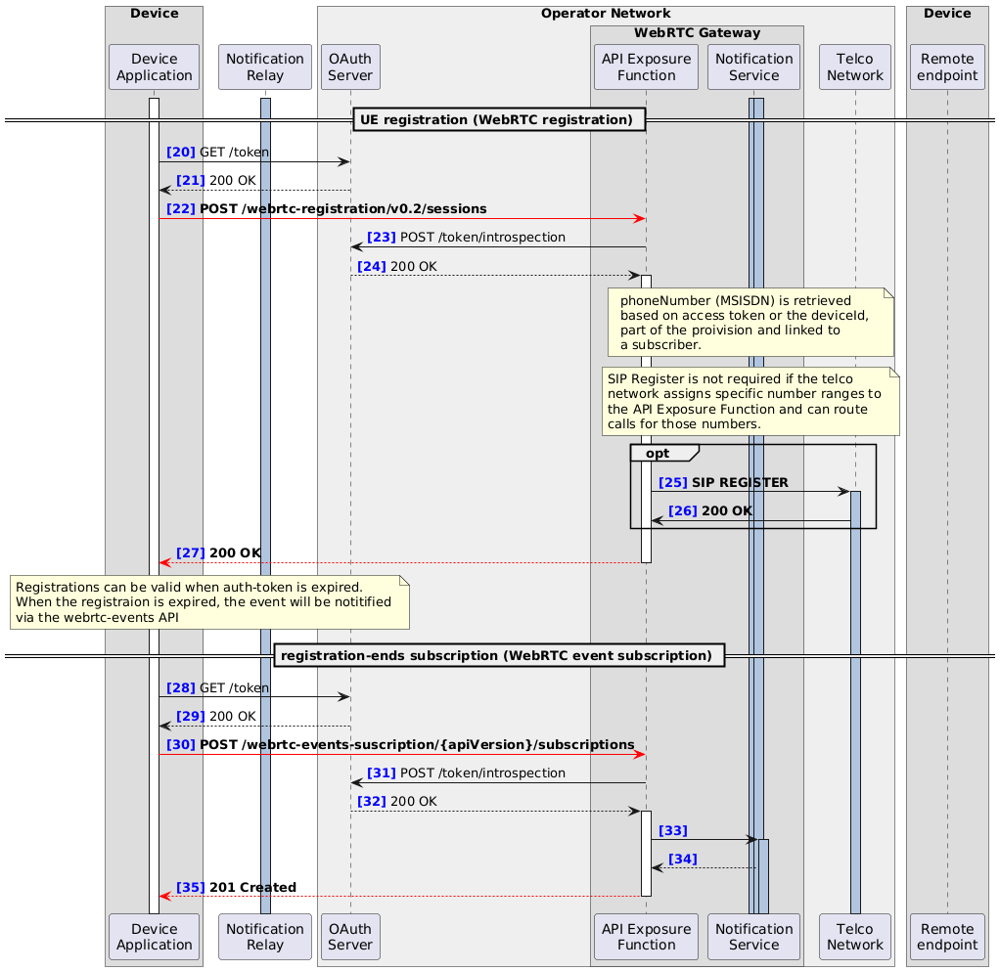

### 4.2. Registration and expiration subscription

This part of the call flow involves registration and its expiration events subscription.

Depending on the WebRTC registration, SIP REGISTER may either be omitted or performed:

- When the Telco network assigns specific phone number ranges to the WebRTC Gateway and accepts SIP INVITE for call routing, SIP REGISTER is omitted.

- When a SIP account is issued for each phone number used for interworking from WebRTC, SIP REGISTER is performed.

Even when SIP REGISTER is performed, it should be noted that the WebRTC Gateway does not have a SIM and therefore cannot use AKA′ authentication, making it different from IMS UE Registration.


#### 4.2.1. Sequence



#### 4.2.2. Example messages

##### 4.2.2.1. [22] POST /webrtc-registration/{apiVersion}/subscriptions
```
{
  "deviceId": "uuid",
  "registrationExpireTime": "2023-01-17T14:18:23.682Z"
}
```

##### 4.2.2.2. [25] SIP REGISTER
```
REGISTER sip:registrar.example.com SIP/2.0
Via: SIP/2.0/UDP webrtcgw.example.local:5060;branch=z9hG4bK74bf9
Max-Forwards: 70
From: <sip:+123456789@registrar.example.com>;tag=1928301774
To: <sip:+123456789@registrar.example.com>
Call-ID: 1234567890@pbx.example.local
CSeq: 1 REGISTER
Contact: <sip:+123456789@192.0.2.1:5060>
Expires: 3600
Content-Length: 0
```

##### 4.2.2.3. [26] 200 OK
```
SIP/2.0 200 OK
Via: SIP/2.0/UDP webrtcgw.example.local:5060;branch=z9hG4bK74bf9
From: <sip:+123456789@registrar.example.com>;tag=1928301774
To: <sip:+123456789@registrar.example.com>;tag=54321
Call-ID: 1234567890@pbx.example.local
CSeq: 1 REGISTER
Contact: <sip:1001@192.0.2.1>;expires=3600
Content-Length: 0
```

##### 4.2.2.4. [27] 200 OK
```
{
  "regInfo": {
    "phoneNumber": "+123456789",
    "regStatus": "Registered"
  },
  "registrationId": "xsmcaum3z4zw4l0cu4w115m0",
  "expiresAt": "2023-01-17T14:18:23.682Z"
```

##### 4.2.2.5. [30] POST /webrtc-events-suscription/{apiVersion}/subscriptions
```
{
  "protocol": "HTTP",
  "sink": "https://notificationServer.opentelco.com",
  "types": [
    "org.camaraproject.webrtc-events.v0.registration-ends"
  ],
  "config": {
    "subscriptionDetail": {
      "registrationId": "xsmcaum3z4zw4l0cu4w115m0"
    }
  }
  "initialEvent": true,
  "subscriptionMaxEvents": 50,
  "subscriptionExpireTime": "2023-01-19T13:18:23.682Z"
}
```

##### 4.2.2.6. [35] 201 Created
```
{
  "sink": "https://notificationServer.opentelco.com",
  "types": [
    "org.camaraproject.webrtc-events.v0.registration-ends"
  ],
  "config": {
    "subscriptionDetail": {
      "registrationId": "xsmcaum3z4zw4l0cu4w115m0"
    },
    "subscriptionExpireTime": "2023-01-19T13:18:23.682Z",
    "subscriptionMaxEvents": 5,
    "initialEvent": true
  },
  "id": "d8418a16-424b-4e64-a472-373922f6be5f",
  "startsAt": "2023-01-17T13:18:23.682Z",
  "expiresAt": "2023-01-18T13:18:23.682Z",
  "status": "ACTIVATION_REQUESTED"
}
```