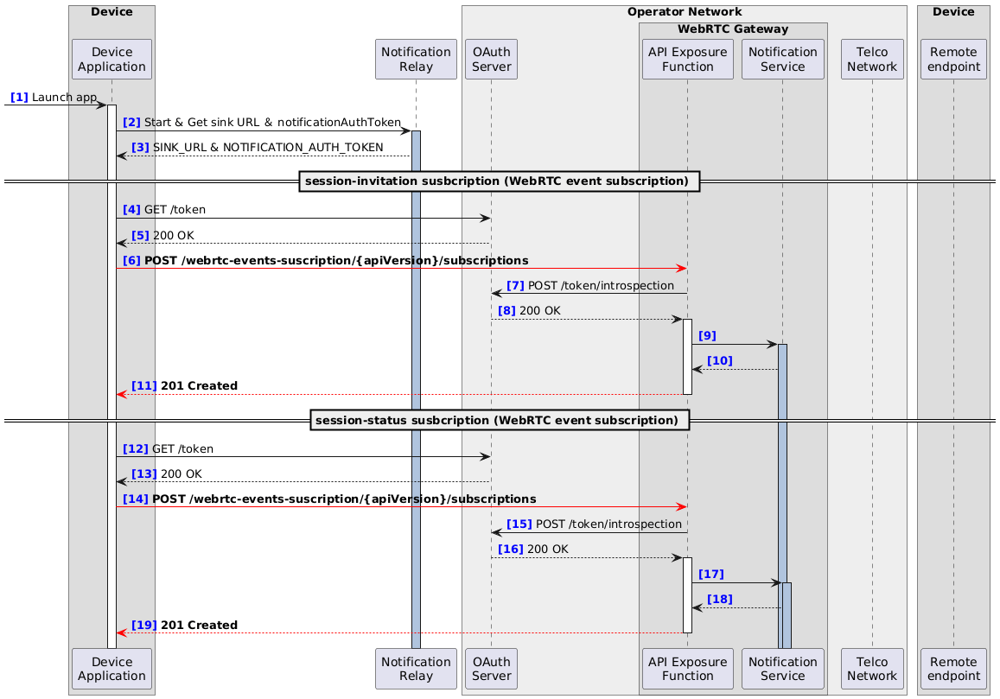

### 4.1. Subscription for call-related events

This part of the call flow involves subscribing to call-related events.

> [!NOTE]
> In line with the Gap Issue(#64), if these subscription takes place prior to the registration, these subscriptions do not require a registrationId to be set.

> [!NOTE]
> If the session-status subscription is decoupled from a specific media session, session-status subscription does not require a sessionId to be set.

> [!NOTE]
> Once the above changes are reflected, it becomes possible to subscribe to these event types at the same time. According to the update of the CAMARA API Design Guide, the sequences [4]–[11] and [12]–[19] can be merged.


#### 4.1.1. Sequence



#### 4.1.2. Example messages

##### 4.1.2.1. [6] POST /webrtc-events-suscription/{apiVersion}/subscriptions
```
{ 
  "protocol": "HTTP",
  "sink": "https://notificationServer.opentelco.com",
  "types": [
    "org.camaraproject.webrtc-events.v0.session-invitation"
  ],
  "config": {
    "subscriptionDetail": {
      "deviceId": "7d444840-9dc0-11d1-b245-5ffdce74fad2",
      ~~"registrationId": "xsmcaum3z4zw4l0cu4w115m0"~~
    },
    "initialEvent": true,
    "subscriptionMaxEvents": 50,
    "subscriptionExpireTime": "2023-01-19T13:18:23.682Z"
  }
}
```

##### 4.1.2.2. [11] 201 Created
```
{
  "sink": "https://notificationServer.opentelco.com",
  "types": [
    "org.camaraproject.webrtc-events.v0.session-invitation"
  ],
  "config": {
    "subscriptionDetail": {
      "deviceId": "7d444840-9dc0-11d1-b245-5ffdce74fad2",
      ~~"registrationId": "xsmcaum3z4zw4l0cu4w115m0"~~
    },
    "subscriptionExpireTime": "2023-01-19T13:18:23.682Z",
    "subscriptionMaxEvents": 5,
    "initialEvent": true
  },
  "id": "f7a23d97-d235-42fb-a82f-5352f223e7e4",
  "startsAt": "2023-01-17T13:18:23.682Z",
  "expiresAt": "2023-01-19T13:18:23.682Z",
  "status": "ACTIVATION_REQUESTED"
}
```

##### 4.1.2.3. [14] POST /webrtc-events-suscription/{apiVersion}/subscriptions
```
{ 
  "protocol": "HTTP",
  "sink": "https://notificationServer.opentelco.com",
  "types": [
    "org.camaraproject.webrtc-events.v0.session-status"
  ],
  "config": {
    "subscriptionDetail": {
      "deviceId": "7d444840-9dc0-11d1-b245-5ffdce74fad2",
      ~~"registrationId": "xsmcaum3z4zw4l0cu4w115m0",~~
      ~~"mediaSessionId": "0AEE1B58BAEEDA3EABA42B32EBB3DFE07E9CFF402EAF9EED8EF"~~
    },
    "initialEvent": true,
    "subscriptionMaxEvents": 50,
    "subscriptionExpireTime": "2023-01-19T13:18:23.682Z"
  }
}
```

##### 4.1.2.4. [19] 201 Created
```
{
  "sink": "https://notificationServer.opentelco.com",
  "types": [
    "org.camaraproject.webrtc-events.v0.session-status"
  ],
  "config": {
    "subscriptionDetail": {
      "deviceId": "7d444840-9dc0-11d1-b245-5ffdce74fad2",
      ~~"registrationId": "xsmcaum3z4zw4l0cu4w115m0",~~
      ~~"mediaSessionId": "0AEE1B58BAEEDA3EABA42B32EBB3DFE07E9CFF402EAF9EED8EF"~~
    },
    "subscriptionExpireTime": "2023-01-19T13:18:23.682Z",
    "subscriptionMaxEvents": 5,
    "initialEvent": true
  },
  "id": "f7a23d97-d235-42fb-a82f-5352f223e7e4",
  "startsAt": "2023-01-17T13:18:23.682Z",
  "expiresAt": "2023-01-19T13:18:23.682Z",
  "status": "ACTIVATION_REQUESTED"
}
```
